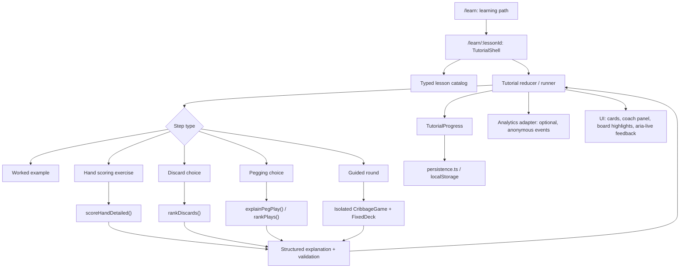

# CribbageX Interactive Tutorial System

**Product and implementation research report**  
**Prepared:** 14 September 2026  
**Audience:** Product, design, and engineering  
**Target user:** A beginner, or a curious player, who wants to learn enough cribbage to play confidently at a real table

## Executive recommendation

Build a short, skippable **Beginner Path** that combines:

1. a visual map of one round;
2. worked scoring examples followed by hands the learner counts;
3. a coached discard and pegging exercise;
4. one deterministic, playable round using the real CribbageX rules engine; and
5. a final independent checkpoint that hands the learner into an Easy game with score explanations.

The product should teach by asking the learner to manipulate cards, not by adding more rule text. The key differentiator is a connected curriculum: **see an example → try the same skill with feedback → use it in a complete round → apply it in a normal game**.

This is technically feasible without a backend or a new application framework. CribbageX already has a `/learn` route, card components, a complete local game state machine, hand scoring, discard ranking, pegging ranking, and `localStorage`. The main prerequisite is to make the rules engine return structured explanations instead of only score totals.

---

## 1. Feature Value Proposition

### Why this matters

Cribbage has an unusually steep first-session comprehension problem for a casual card game:

- A round has several modes that look unrelated at first: discard, starter, pegging, hand counting, and crib counting.
- The same cards behave differently during pegging and during the show.
- A card can participate in more than one scoring combination.
- Dealer ownership changes discard strategy because the crib can help or hurt the learner.
- Important exceptions—crib flushes, “go,” last card, nibs/his heels, and nobs—are easy to miss or confuse.
- Automatic scoring lets someone complete a digital game without learning how a physical game works.

The current Learn screen explains these rules accurately, but it is a reference page. Its four guided lessons are disabled, and the live score explanation displays only a total with “Point-by-point breakdown coming soon.” A new learner must therefore translate text into actions unaided.

### User pain point

The beginner’s real question is not “Can I read the rules?” It is:

> “Can I make the next move, explain why points were awarded, and play without another person correcting me?”

The tutorial should reduce three anxieties:

1. **Orientation:** “What happens next in a round?”
2. **Calculation:** “Did I find every scoring combination?”
3. **Decision confidence:** “Which cards should I discard or play, and why?”

### Product value

For the target audience, the feature changes CribbageX from a game that assumes cribbage knowledge into a learning product with a clear first-session promise:

> **Learn one complete round in about 15 minutes, then play with optional coaching.**

This supports CribbageX’s strongest plausible market position: an ad-free, no-account, local-first practice table that teaches the real rules and shows its reasoning.

### Learning design principle

Use **worked examples with faded assistance**, not an immediate exam. Research on novice learning consistently finds that worked examples reduce unnecessary cognitive load; tutored practice adds value through sub-goals, immediate step feedback, and hints. In product terms:

- First show and narrate a scoring combination.
- Next ask the learner to identify one part of a similar hand.
- Then ask for all combinations and the total.
- Finally place the skill inside a real round.

This is more suitable for a novice than dropping them into a full game with a generic “Hint” button.

---

## 2. Competitive Analysis & Benchmarking

### Selection and evidence note

The closest benchmarks are **Cribbage Classic**, **Cribbage Club**, and **Cribbage Pro**. They are prominent products with meaningful learning features, but none publicly documents the exact complete flow proposed here. Findings below combine official product pages, current store listings, the live Cribbage Classic web client, and official help material. Store-listing claims are treated as vendor claims, not independently verified learning outcomes.

### 2.1 Cribbage Classic

**Comparable feature set:** tutorial, manual counting, muggins, hints, discard analysis, and post-game error review.

#### UX / workflow

1. The user can page through a tutorial panel explaining the board and the four round stages.
2. In normal play, manual counting can be enabled in settings.
3. The player clicks each subset of cards that scores, submits it, and finishes counting.
4. With muggins enabled, the computer receives missed points.
5. Suboptimal discard prompts can let the player retry, request a hint, inspect alternatives, or continue.
6. The Discard Analyzer evaluates all discard pairs and reports minimum, maximum, and average outcomes.
7. A post-game summary reports suboptimal plays and cumulative expected points lost.

#### Strengths

- It connects teaching to authentic gameplay rather than isolating every lesson.
- Clicking scoring subsets is much better practice than entering only a total.
- The discard analyzer exposes expected value and crib ownership, giving advanced learners a path beyond rules.
- Retry, hint, and “play anyway” preserve learner agency.
- Post-game error history makes improvement visible.
- The browser version has very low access friction.

#### Weaknesses / gaps

- The tutorial is primarily a paged rules presentation; it is not a structured beginner curriculum with prerequisites and mastery checks.
- Manual scoring is a setting inside the full game, so a novice can encounter a complex hand before learning the basic counting method.
- “Suboptimal” and “error” framing can feel punitive when a choice is strategically defensible or the learner is still exploring.
- The analyzer is information-dense and optimized more for improvement than first-time comprehension.
- The live interface is visually dated and presents many controls and messages at once.
- The product explains components of play, but it does not clearly stage a single safe, deterministic first round from deal through crib count.

### 2.2 Cribbage Club

**Comparable feature set:** vendor-described interactive tutorial, manual scoring, muggins, hand analyzer, discard analyzer, hints/suggestions, and three difficulty levels.

#### UX / workflow

Based on its current official store listing, a beginner starts with an interactive tutorial, practices crib and pegging concepts, can switch to manual scoring, and can use hand/discard analyzers to inspect choices. Normal games against named AI opponents then provide the practice context. The product also offers achievements, statistics, online play, and a daily discard competition.

#### Strengths

- It markets itself explicitly as a trainer for complete beginners.
- Manual scoring and analyzers cover both rules acquisition and strategy development.
- Multiple AI levels provide a natural transition from training to play.
- High-visibility cards and offline play suit older and casual learners.
- Daily discard analysis creates a repeatable practice habit.

#### Weaknesses / gaps

- The public description emphasizes the breadth of tools more than a coherent start-to-finish learning path.
- Tutorial, manual scoring, analyzers, normal play, achievements, and competitions can create choice overload for a first-time player.
- It is mobile/Android-led rather than an instant, cross-device browser learning experience.
- Ads and in-app purchases interrupt the “safe practice table” proposition.
- Current store reviews include complaints about interface clarity, card readability, and perceived shuffle fairness. Individual reviews are anecdotal, but they expose trust and usability risks that a learning product should avoid.
- There is no public evidence of a mastery model that adapts examples or revisits missed concepts.

### 2.3 Cribbage Pro

**Comparable feature set:** single-player hints, manual counting with muggins, score details, hand grading/discard analysis, external scorer, three difficulty levels, and ACC-aligned rules.

#### UX / workflow

1. The player enables manual counting in settings and plays a normal single-player or multiplayer game.
2. The player claims a hand score; muggins can award missed points to the opponent.
3. Over-counting is recorded and the excess is awarded to the opponent.
4. A Score Details view explains the correct count after scoring.
5. Hand Grade analysis compares discard quality.
6. A separate web scorer lets the player enter a hand or crib to verify a disputed count.
7. Hints are available in single-player play.

#### Strengths

- Practice happens under authentic game pressure and transfers well to real manual play.
- Its rules are explicitly based on American Cribbage Congress rules.
- Manual scoring, muggins, hints, and hand grading support a wide skill range.
- The product has strong category credibility, cross-platform reach, and a route from beginner play to serious competition.
- Score Details and the external scorer help resolve rule confusion.

#### Weaknesses / gaps

- Manual counting assumes the learner already understands how to find combinations.
- The learning experience is fragmented across settings, in-game details, help, and a separate scorer.
- Muggins and over-count penalties reproduce tournament consequences before a beginner has a safe practice space.
- A normal full game is a long feedback loop for learning one concept.
- “Hand Grade” expresses outcome quality but is less useful to a beginner unless the reasoning is translated into plain language.
- Ads, account-oriented multiplayer, and competitive systems add distractions that are unnecessary for first-round learning.

### Benchmark summary

| Product | Best pattern to adopt | Main gap to avoid |
| --- | --- | --- |
| Cribbage Classic | Select actual scoring subsets; retry/hint/continue; EV-based discard review | A rule carousel and full-game settings are not a beginner curriculum |
| Cribbage Club | Trainer positioning; broad practice tools; easy transition to AI games | Tool breadth can become choice overload; mobile/ads reduce focus |
| Cribbage Pro | Authentic manual counting; detailed verification; authoritative rules | Punitive, fragmented learning begins too far up the skill curve |

### Differentiation opportunity

CribbageX should not compete by adding another static rules page or a larger analyzer. It can out-innovate these products with a **connected, mastery-based first-round experience**:

1. **One visible learning path.** The learner always knows the current skill, what remains, and why it matters in a round.
2. **Progressive assistance.** Worked example → guided selection → independent count, with hints that reveal one step rather than the whole answer.
3. **A deterministic real round.** The cards are curated, but every action and score is validated by the production rules engine. Label it clearly as a training deal, not a random deal.
4. **Explainable choices.** Use plain-language cause and effect: “Keeping 5–5 guarantees a pair and makes 15 with any ten-value starter,” not only “EV 7.4.”
5. **A safe tone.** Use “Let’s find the missing two points” instead of “error” or immediate muggins penalties.
6. **Teach the quirks in context.** Contrast nobs with nibs/his heels at the moment a jack appears, and contrast a four-card hand flush with a crib flush using adjacent examples.
7. **Seamless transfer.** Finish with “Play your first game,” retaining the same visual vocabulary and score explanations. A fuller Coach Mode can follow in V2.
8. **Local-first trust.** No account is required; tutorial progress stays on the device; analytics, if enabled, contain no hand history or personal data.

---

## 3. Proposed Technical & Architecture Implementation

### Current-state implications

Relevant existing foundations:

- `src/screens/Learn.tsx` already owns the learning entry point, but its guided lesson controls are disabled.
- `src/app/game.ts` contains `scoreHand`, `rankDiscards`, `rankPlays`, and the game state machine.
- `src/Cribbage.tsx` already renders `ScoreExplanation`, but the component currently shows only the total.
- `src/features/game/gameSlice.ts` defines a serializable `PCard` contract while mutable `Card`, `Hand`, and `CribbageGame` instances stay outside Redux.
- `src/app/persistence.ts` stores preferences and lifetime stats locally under `cribbagex.v1`.
- `CribbageGame` accepts a `Deck`, which creates a useful seam for a deterministic training deck.

The most important engineering decision is to keep **one source of truth for rules**. Tutorial answers must be generated by the same engine that scores the live game.

### Proposed architecture



### Recommended modules and contracts

Suggested file shape:

```text
src/
  app/
    game.ts                         # existing engine; add pure detailed scoring
    persistence.ts                  # migrate and persist tutorial progress
  features/
    tutorial/
      lessonTypes.ts                # typed lesson and step contracts
      lessonCatalog.ts              # ordered curriculum and curated deals
      tutorialReducer.ts            # progress, attempts, hint level, completion
      tutorialValidation.ts         # delegates to game engine
      tutorialAnalytics.ts          # small vendor-neutral event adapter
  components/
    tutorial/
      TutorialShell.tsx
      CoachPanel.tsx
      RoundMap.tsx
      HandScoringExercise.tsx
      DiscardExercise.tsx
      PeggingExercise.tsx
      GuidedRound.tsx
  screens/
    Learn.tsx                       # path overview and resume entry
    Lesson.tsx                      # route-level lesson screen
```

#### A. Structured hand scoring

Refactor scoring around a pure detailed result:

```ts
type ScoringGroup = {
  id: string
  category: "fifteen" | "pair" | "run" | "flush" | "nobs"
  cardIds: string[]
  points: number
  label: string
}

type HandScoreResult = {
  total: number
  groups: ScoringGroup[]
  isCrib: boolean
}

function scoreHandDetailed(
  hand: ReadonlyArray<Card>,
  starter: Card | undefined,
  isCrib: boolean,
): HandScoreResult
```

Then preserve the existing API:

```ts
function scoreHand(hand, starter, isCrib) {
  return scoreHandDetailed(hand, starter, isCrib).total
}
```

Important requirements:

- Clone before sorting; detailed scoring should not mutate card order.
- Enumerate the actual subsets for fifteens and runs so the UI can highlight them.
- Give every physical card a stable exercise ID. Suit + rank is unique in a standard deck, but an explicit ID keeps UI selection logic simple.
- Treat crib flush rules inside this function, not as tutorial answer-key logic.
- Return nobs as its own group.
- Keep nibs/his heels outside hand scoring because it is triggered by the starter and belongs to the dealer.

#### B. Structured pegging explanation

The live engine already emits score actions for 15, 31, run, pair, and last card. Extract the calculation into a pure helper:

```ts
type PeggingScoreResult = {
  newCount: number
  legal: boolean
  events: Array<{
    category: "fifteen" | "thirty-one" | "pair" | "run" | "last-card"
    points: number
    cardIds: string[]
  }>
  total: number
}
```

`CribbageGame.doAction` and the tutorial should both consume this helper. This prevents the coach from describing a different run or pair than the game awards.

#### C. Typed lesson content

Use TypeScript data, not a general-purpose content-management system for MVP:

```ts
type TutorialStep =
  | { kind: "explain"; title: string; body: string; focus?: FocusTarget }
  | { kind: "score-example"; scenarioId: string }
  | { kind: "score-practice"; scenarioId: string; hintPolicy: HintPolicy }
  | { kind: "discard-practice"; scenarioId: string }
  | { kind: "peg-practice"; scenarioId: string }
  | { kind: "guided-round"; scriptId: string; checkpoint: RoundCheckpoint }
  | { kind: "recap"; concepts: ConceptId[] }
```

Advantages:

- Compile-time validation of lesson structure.
- Easy unit testing and version control.
- No runtime network dependency.
- No unsafe HTML.
- Lesson content ships with the static bundle and works offline.

Move to JSON validated with a schema only if non-engineers genuinely need to author lessons. A CMS is unnecessary for the initial curriculum.

#### D. Deterministic guided round

Do not drive the tutorial through the module singleton `thePlayer`. A tutorial must be restartable and must not inherit pending AI queues, delays, or live-game state.

Recommended approach:

1. Instantiate a separate `CribbageGame`.
2. Supply a `FixedDeck` implementing the existing `Deck` contract.
3. Define expected learner checkpoints, not duplicated score totals.
4. Validate card actions through `CribbageGame.doAction`.
5. Script the opponent’s legal actions and pause after each concept.
6. Render tutorial state as serializable `PCard`/step state; keep mutable game objects outside Redux, matching the existing architecture.
7. Mark the deal in the UI as **Training deal—cards are intentionally chosen** so fairness messaging remains honest.

For the first release, one guided round is enough. It should deliberately include:

- a discard decision with an obvious keep;
- a crib ownership explanation;
- a starter card;
- a pegging 15 or pair;
- a “go” or last-card reset;
- a hand containing several straightforward scoring groups;
- one contextual quirk, preferably nobs;
- the count order: non-dealer, dealer, crib.

Nibs/his heels can be demonstrated as a short branch or replayable micro-example; forcing every quirk into one deal would make the round feel artificial.

### State and persistence

Suggested progress shape:

```ts
type TutorialProgress = {
  curriculumVersion: number
  startedAt?: string
  completedLessonIds: string[]
  currentLessonId?: string
  currentStep: number
  conceptMastery: Partial<Record<ConceptId, {
    attempts: number
    independentCorrect: number
    hintsUsed: number
  }>>
  completedAt?: string
}
```

Persist through `src/app/persistence.ts`, not direct `localStorage` calls from components. Introduce a versioned migration that preserves existing preferences and lifetime statistics. Progress should survive refreshes, but an individual interactive step should be safely restartable if its runtime game object is not serializable.

### Ideal stack

Use the existing stack:

- React 18 and TypeScript strict mode.
- React Router for `/learn/:lessonId`.
- Existing React Bootstrap components for layout, progress, modal/popover patterns, and responsive behavior.
- A local `useReducer` or small Redux tutorial slice for serializable runner state.
- Existing card and board components, extended for focus/highlight/disabled states.
- Vitest, jsdom, and Testing Library for engine, reducer, and interaction tests.
- `localStorage` through the existing persistence boundary.

No backend, database, account system, animation framework, CMS, or additional state library is required for MVP.

### Analytics approach

Central product KPIs cannot be measured from device-only `localStorage`. If aggregate product analytics are desired:

- Add a tiny internal analytics interface so lesson code does not depend on a vendor.
- Use a privacy-focused, cookieless configuration of a low-cost service such as PostHog, Plausible, or Umami.
- Disable session replay and automatic DOM capture.
- Send only allowlisted events and coarse properties.
- Respect consent and regional requirements; continue to function fully if analytics are blocked.

Suggested event vocabulary:

```text
tutorial_path_viewed
tutorial_started                 { curriculumVersion }
tutorial_step_completed          { lessonId, stepKind, attemptBand, hintBand }
tutorial_lesson_completed        { lessonId, durationBand }
tutorial_completed               { durationBand }
coach_game_started               { source: "tutorial_complete" }
first_game_completed             { tutorialStatus }
```

Do not transmit card sequences, exact timestamps of every click, free text, names, IP-derived location, or stable cross-device identifiers.

### Testing strategy

1. **Engine unit tests**
   - Detailed result total always equals current `scoreHand`.
   - Every fifteen, pair, run multiplicity, flush, nobs, and crib-flush case.
   - Perfect 29 hand.
   - Pegging 15/31, pairs/triples/quads, out-of-order runs, go, and last card.
   - Input arrays are not mutated.

2. **Lesson validation tests**
   - Every referenced scenario exists.
   - Every scripted card is unique and every scripted action is legal.
   - Every lesson ends in recap or completion.
   - Every required beginner concept appears at least once and every assessed concept has a worked example first.

3. **Reducer/component tests**
   - Correct/incorrect selection, incremental hinting, retry, skip, resume, restart.
   - Keyboard-only card selection.
   - Screen-reader announcements for correctness and score movement.

4. **Guided-round integration test**
   - Drive the complete fixed round through actual engine actions.
   - Assert scores, stage transitions, crib ownership, and completion.

5. **Browser acceptance**
   - Complete the path on desktop and a narrow mobile viewport.
   - Refresh mid-lesson and resume.
   - Exercise cut/discard/peg/show in the coached round.
   - Verify reduced motion, visible focus, and readable zoom at 200%.

### Major constraints and risks

#### Technical

- `Card`, `Hand`, and `CribbageGame` are mutable. Do not put them in Redux or tutorial persistence.
- `thePlayer` is a singleton with queued actions and delays; sharing it with a tutorial would make restart/resume brittle.
- The current `scoreHand` returns only a number and sorts an internal array path; detailed scoring should be pure and non-mutating.
- Current card rendering is absolutely positioned. The tutorial needs responsive hit targets, focus states, and non-overlapping labels on small screens.
- Generated/random exercises can accidentally be ambiguous or too hard. Curated scenarios should be used until difficulty classification is tested.
- A scripted tutorial round is intentionally not random. It must never be presented as evidence about normal shuffle fairness.

#### Accessibility

- Do not encode suit or correctness by color alone.
- Every card must be a real keyboard-operable control with an accessible name such as “Five of hearts, selected.”
- Use `aria-live="polite"` for feedback and score announcements, but avoid narrating every decorative movement.
- Provide reduced-motion behavior and avoid timers in lessons.
- Keep tap targets at least 44×44 CSS pixels and retain legibility at 200% zoom.
- Let the user replay instructions and advance manually.

#### Security and privacy

- Treat persisted progress as untrusted input and sanitize it as the current persistence module sanitizes stats.
- Never render lesson copy with unsanitized `dangerouslySetInnerHTML`.
- Keep dependencies minimal to reduce supply-chain exposure.
- Do not collect personal information. The audience may include minors, so avoid profiles, chat, precise age, or behavioral fingerprinting.
- If analytics is introduced, publish a concise privacy disclosure, support consent withdrawal, use short retention, and honor Global Privacy Control where applicable.
- Tutorial failure must never block normal play; corrupted progress should reset only the tutorial portion.

---

## 4. Concrete UX/UI Implementation Suggestions

### Curriculum structure

Use a single beginner path made of short lessons:

1. **The shape of a round** — objective, board, dealer, and four phases.
2. **Count a hand** — fifteens, pairs, runs, flushes, and nobs.
3. **The crib and the discard** — six to four, whose crib, safe beginner heuristics.
4. **Peg to 31** — legal plays, 15, 31, pair, run, go, and last card.
5. **Play a coached round** — combine the skills in correct order.
6. **Ready-table checkpoint** — independently count one hand and make two legal decisions.

Include a small, separate “Cribbage quirks” replay section for:

- nibs/his heels versus nobs;
- four-card hand flush versus five-card crib flush;
- a card reused across multiple fifteens;
- double and multiple runs;
- “go” versus last card.

### Step-by-step user journey

#### Entry and orientation

1. The splash retains **Learn** as a primary action.
2. The Learn page leads with: “New to cribbage? Learn one round in about 15 minutes.”
3. The user selects **Start beginner path** or **Resume**.
4. A compact round map appears: `Deal → Discard → Starter → Pegging → Show → Crib`.
5. The learner can skip, exit, or open the rules reference at any time. Skip does not falsely mark mastery.

#### Scoring lesson

6. Show a worked five-card scoring view. Highlight one group at a time: “5 + K = 15, worth 2.”
7. Ask the learner to select the pair in a similar hand.
8. Give immediate, local feedback:
   - Correct: retain highlight and add the points to a visible running total.
   - Incorrect: explain why that subset does not score; do not clear all progress.
9. Ask the learner to find all fifteens, then all pairs/runs, then enter or confirm the total.
10. Offer tiered hints:
    - Hint 1: name the category still missing.
    - Hint 2: highlight one relevant card.
    - Hint 3: show and explain the complete group.
11. Demonstrate nobs and then contrast it with a jack starter awarding nibs/his heels to the dealer.
12. Demonstrate the crib flush exception with two adjacent hands.

#### Discard lesson

13. Deal six visible cards and identify the crib owner before asking for a choice.
14. Ask the learner to choose two cards for the crib.
15. On confirmation, compare the choice with one or two strong alternatives:
    - guaranteed hand points;
    - likely starter help;
    - crib benefit or crib risk.
16. Use plain language first; expected value can be revealed under “Show the math.”

#### Pegging lesson

17. Present a short, scripted sequence with the running count always visible.
18. Ask which cards are legal, then which play scores immediately.
19. Animate only the selected card and the awarded peg movement.
20. Pause to explain out-of-order pegging runs.
21. Create one “go” situation and explicitly show who continues, who leads after reset, and why the last-card point is awarded.

#### Guided round

22. Start a deterministic round with the phase map persistent at the top.
23. At each phase, the coach gives one goal and then gets out of the way.
24. The learner performs the discard and all their pegging actions.
25. At the show, the learner manually identifies groups in their hand; opponent and crib counts are demonstrated more quickly to maintain pace.
26. The recap replays the learner’s three most important actions, not every click.

#### Completion and transfer

27. The final checkpoint contains no proactive hints; hints remain available but the attempt is recorded as assisted.
28. Completion shows concept-level results such as “Round flow: ready; Hand counting: ready; Pegging: practiced.”
29. Primary next action: **Play your first Easy game**, with point-by-point score explanations enabled.
30. Secondary actions: replay a weak concept, browse rules, or return home.

### Feedback copy guidelines

Prefer:

- “That makes 15, so it scores 2.”
- “You found all the pairs. There is still one run.”
- “Legal play, but another card scores now. Want a clue?”
- “Because this is their crib, avoid feeding a pair of fives.”

Avoid:

- “Wrong.”
- “Suboptimal move.”
- “You lost 1.43 expected points” as the only explanation.
- Automatic muggins during the beginner path.

### Text wireframe: Learn landing

```text
┌──────────────────────────────────────────────────────────────────┐
│ Learn Cribbage                                      [Rules] [×]  │
│ Learn one complete round in about 15 minutes.                    │
│                                                                  │
│ [ Start beginner path ]   or   [ Resume: Count a hand, step 4 ] │
│                                                                  │
│ Deal ── Discard ── Starter ── Pegging ── Show ── Crib           │
│                                                                  │
│ BEGINNER PATH                                                    │
│  ✓ 1. The shape of a round                         2 min         │
│  → 2. Count a hand                                  5 min         │
│  ○ 3. The crib and discard                          3 min         │
│  ○ 4. Peg to 31                                     4 min         │
│  ○ 5. Play a coached round                          6 min         │
│  ○ 6. Ready-table checkpoint                        2 min         │
│                                                                  │
│ QUICK PRACTICE                                                   │
│ [Count a hand] [Pegging] [Cribbage quirks]                       │
└──────────────────────────────────────────────────────────────────┘
```

### Text wireframe: Interactive lesson

```text
┌──────────────────────────────────────────────────────────────────┐
│ Count a hand                  Step 4 of 7          [Exit] [Rules]│
│ Deal ─ Discard ─ Starter ─ Pegging ─ [SHOW] ─ Crib               │
├──────────────────────────────────────┬───────────────────────────┤
│ TABLE / WORKSPACE                    │ COACH                     │
│                                      │ Find every combination    │
│ Starter                              │ that totals 15.           │
│   [ 7♣ ]                             │                           │
│                                      │ Fifteens: 1 of ?          │
│ Your hand                            │ Pairs: not started        │
│ [ 3♥ ] [ 5♠ ] [ 5♦ ] [ K♣ ]         │ Runs: not started         │
│                                      │                           │
│ [selected-card summary]              │ Running score: 2          │
│                                      │                           │
│ [Count selected cards] [Clear]       │ [Hint] [Show method]      │
│                                      │                           │
│ Peg preview: 2 spaces                │ “5 + K = 15 for 2.”       │
├──────────────────────────────────────┴───────────────────────────┤
│ [Back]                         Progress 57%              [Next]  │
└──────────────────────────────────────────────────────────────────┘

Narrow screens: Coach appears above the cards; actions remain sticky at
the bottom. No essential information depends on hover or card color.
```

### Text wireframe: Guided round

```text
┌──────────────────────────────────────────────────────────────────┐
│ Coached round                           Phase 2: DISCARD          │
│ Deal ── [Discard] ── Starter ── Pegging ── Show ── Crib          │
├──────────────────────────────────────────────────────────────────┤
│ Opponent: 0                                      Their crib      │
│                         [ CRIB ]                                 │
│                                                                  │
│                       Cribbage board                             │
│                                                                  │
│ You: 0                                                          │
│ [ A♠ ] [ 4♥ ] [ 5♦ ] [ 5♣ ] [ 6♠ ] [ K♥ ]                     │
│                                                                  │
│ Coach: Keep four cards. Choose two to send to their crib.        │
│        Start by protecting combinations already in your hand.    │
│                                                                  │
│ [Hint]                    [Confirm two discards]                  │
└──────────────────────────────────────────────────────────────────┘
```

---

## 5. Phased Rollout Strategy

### Phase 0: Engine and content foundation

This is not a user-facing release, but it is necessary to avoid fragile tutorial logic.

- Implement `scoreHandDetailed` and structured pegging explanation.
- Make live scoring consume the same detailed result.
- Create typed scenarios and a lesson validator.
- Add tutorial persistence migration.
- Confirm accessibility behavior for selectable cards.
- Instrument the analytics adapter, even if its production transport is initially disabled.

**Exit criterion:** all existing score totals remain unchanged; detailed output is exhaustively tested; one scripted round can run through the engine.

### MVP: Beginner Path

The minimum viable feature should include:

1. A redesigned Learn landing page with Start/Resume and visible lesson progress.
2. A round-flow lesson.
3. Three tiers of hand-counting practice:
   - worked example;
   - guided count;
   - independent count.
4. Coverage of fifteens, pairs, runs, hand/crib flushes, nobs, and nibs/his heels.
5. One discard exercise for the learner’s crib and one for the opponent’s crib.
6. One pegging exercise covering legal play, 15/31, pair/run, go, and last card.
7. One deterministic guided round using the real game engine.
8. A final checkpoint and launch into an Easy game.
9. Local progress, restart, skip, and resume.
10. Keyboard, screen-reader, reduced-motion, mobile, and 200%-zoom support.

Do **not** include in MVP:

- generated infinite exercises;
- adaptive algorithms;
- accounts or cloud sync;
- a CMS;
- muggins;
- badges, streaks, or leaderboards;
- complex EV charts;
- narrated video;
- multiplayer tutorial flows.

These additions do not prove the core hypothesis: that a connected interactive path helps a beginner understand and finish a real game.

### V2: Practice and in-game transfer

Hold back these advanced capabilities:

#### 1. Adaptive practice and spaced review

- Generate valid hands by concept and difficulty.
- Track independent mastery separately from hint-assisted completion.
- Re-present concepts the learner misses, particularly multiple fifteens, double runs, crib flushes, and “go.”
- Add a daily two-minute practice session without requiring a streak.

#### 2. Coach Mode in normal games

- Optional contextual prompts during discard, pegging, and show.
- “Why?” explanations powered by `rankDiscards`, `rankPlays`, and detailed scoring.
- Adjustable support: full coach, hints only, score breakdown only, off.
- Post-round recap of at most two useful learning moments.

#### 3. Strategy lab

- Compare all discard choices with expected hand and crib contribution separated.
- Replay pegging alternatives from a completed round.
- Save mistaken concepts locally as practice prompts.
- Use plain-language explanations before advanced expected-value details.

### V3: Reach and deeper retention

Potential later capabilities:

- Shareable, privacy-safe hand challenges encoded in a URL.
- Audio narration and localization.
- Teacher/club mode with a projector-friendly board and controlled lesson pace.
- Optional local export/import of progress.
- Manual scoring with configurable muggins in normal play.
- A curated challenge library for common traps and rare quirks.

### Rollout mechanics

1. Ship internally behind a build-time feature flag.
2. Run moderated usability sessions with 5–8 people who have never played cribbage. Observe without teaching.
3. Fix comprehension blockers before measuring speed or visual polish.
4. Release to a percentage of new visitors while keeping the existing rules reference available.
5. Compare new-user game completion against a pre-launch baseline or randomized holdout.
6. Roll out broadly only after rule correctness, accessibility, and resume reliability are stable.

Critical usability tasks:

- Explain whose crib it is.
- Correctly count a multi-combination hand.
- Explain nobs versus nibs/his heels.
- Complete a “go” sequence.
- Finish the guided round and start a normal game.

---

## 6. Success Metrics (KPIs)

Use four primary KPIs. Report first-time visitors separately from returning players and assisted completions separately from independent mastery.

### 1. Tutorial activation rate

**Definition**

```text
unique first-time visitors who start the Beginner Path
÷ unique first-time visitors who view the splash or Learn page
```

Track splash-to-Learn click-through and Learn-to-Start conversion separately. This shows whether the feature is discoverable and whether its promise is compelling.

**Initial product goal:** establish a two-week baseline, then target at least 30% of new visitors entering the path. The final target should be adjusted to actual acquisition intent.

### 2. Beginner Path completion rate

**Definition**

```text
learners who complete the final checkpoint within 7 days
÷ learners who start the Beginner Path
```

Also inspect completion by lesson and step. A large drop at “Count a hand” indicates cognitive or interaction friction; a drop at the guided round indicates length or state-machine friction.

**Initial product goal:** 40% or better end-to-end completion, with no single required step losing more than 25% of entrants.

### 3. Independent concept mastery

**Definition**

Percentage of final-checkpoint concepts completed correctly on the first attempt without Hint 2/3:

- hand total and all scoring groups;
- crib ownership/discard direction;
- legal and scoring pegging play;
- nobs versus nibs/his heels.

This is more meaningful than lesson completion because a learner can advance with help.

**Initial product goal:** at least 75% of completers independently pass each core concept. If a concept is lower, revise its worked example before adding more practice volume.

### 4. Transfer to real play

**Primary definition**

```text
new visitors who complete their first normal game within 24 hours
```

Compare tutorial completers, tutorial starters who do not complete, and a pre-launch/holdout cohort. Control interpretation for self-selection: motivated learners are more likely both to finish a tutorial and a game.

**Initial product goal:** improve first-normal-game completion by at least 15 percentage points versus the eligible baseline/holdout without increasing early quits.

**Secondary diagnostic:** seven-day return rate after tutorial completion. Use it as supporting evidence rather than the only success metric because CribbageX does not yet have strong recurring content.

### KPI guardrails

Do not optimize completion by making every answer automatic. Track:

- skip rate;
- Hint 2/3 usage;
- repeat incorrect attempts;
- median duration by lesson;
- accessibility failures and tutorial resets;
- normal-game quit rate after tutorial.

A fast tutorial with low independent mastery is not successful. A rigorous tutorial that few beginners finish is also not successful.

---

## Recommended delivery order

1. Detailed, pure scoring result and point-by-point live explanation.
2. Hand-scoring exercise with worked-example fading.
3. Structured pegging evaluator and micro-exercise.
4. Discard explanation using existing ranking helpers.
5. Typed curriculum runner and progress persistence.
6. Isolated fixed-deck guided round.
7. Final checkpoint and Easy-game handoff.
8. Privacy-preserving analytics and staged rollout.

This order creates user value early: the structured score explanation improves the normal game even before the full tutorial ships.

---

## Sources

Accessed 14 September 2026 unless noted.

### Competitors

- [Cribbage Classic live web client](https://cribbageclassic.com/) — tutorial sequence, manual subset counting, muggins, discard feedback, analyzer, and post-game error summary.
- [Cribbage Classic — Google Play](https://play.google.com/store/apps/details?id=com.gamesbypost.cribbageclassic&hl=en_US) — official feature description, release status, data-safety disclosure, and selected user feedback.
- [Cribbage Club — Google Play](https://play.google.com/store/apps/details?id=com.nickelbuddy.cribbageclubfree&hl=en_US) — official claims for interactive tutorial, manual scoring, analyzers, and trainer workflow; data-safety disclosure and selected user feedback.
- [Cribbage Pro — Google Play](https://play.google.com/store/apps/details?id=com.fullersystems.cribbage&hl=en_US) — hints, manual counting with muggins, difficulty levels, rules positioning, and data-safety disclosure.
- [Cribbage Pro FAQ / How To](https://www.cribbagepro.net/faq-how-to.html) — manual-count behavior, score verification, Hand Grade, and rules questions.
- [Cribbage Pro rules](https://www.cribbagepro.net/about/rules.html) — published scoring chart and ACC-rules basis.

### Rules and pedagogy

- [American Cribbage Congress 2025 Rulebook](https://www.cribbage.org/NewSite/rules/ruleBook_2025.pdf) — authoritative definitions and rules for crib flush, pegging, nobs, and his heels/nibs.
- Van Gog et al., [“The efficiency of worked examples compared to erroneous examples, tutored problem solving, and problem solving in computer-based learning environments”](https://doi.org/10.1016/j.chb.2015.08.038), *Computers in Human Behavior* 53 (2015), 87–99.
- Salden et al., [“Accounting for Beneficial Effects of Worked Examples in Tutored Problem Solving”](http://pact.cs.cmu.edu/pubs/SaldenEtAl-BeneficialEffectsWorkedExamplesinTutoredProbSolving-EdPsychRev2010.pdf), *Educational Psychology Review* 22 (2010), 379–392.
- NSW Centre for Education Statistics and Evaluation, [“Cognitive load theory in practice: Examples for the classroom”](https://education.nsw.gov.au/content/dam/main-education/about-us/educational-data/cese/2017-cognitive-load-theory-practice-guide.pdf) (2017).

### CribbageX repository

- `src/screens/Learn.tsx`
- `src/components/ScoreExplanation.tsx`
- `src/app/game.ts`
- `src/app/gamePlayer.ts`
- `src/features/game/gameSlice.ts`
- `src/app/persistence.ts`
- `src/Cribbage.tsx`

### Research limitations

- Competitor flows can change without notice.
- Cribbage Club tutorial details are based primarily on its official store description; the report does not claim an independent task-by-task usability audit.
- Store reviews are anecdotal signals, not representative quantitative evidence.
- KPI targets are launch hypotheses. They should be recalibrated after collecting a baseline and observing actual acquisition channels.
